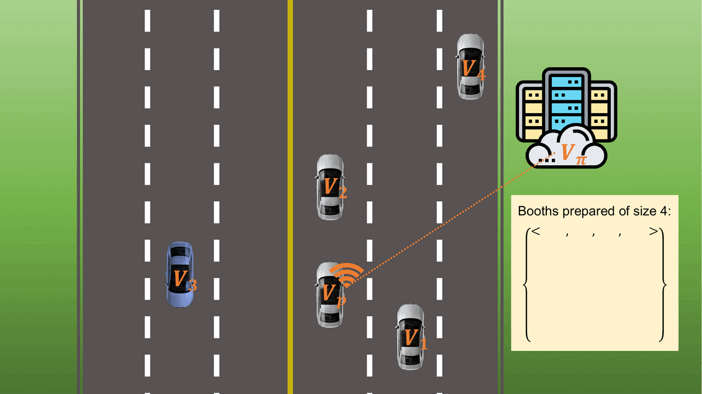
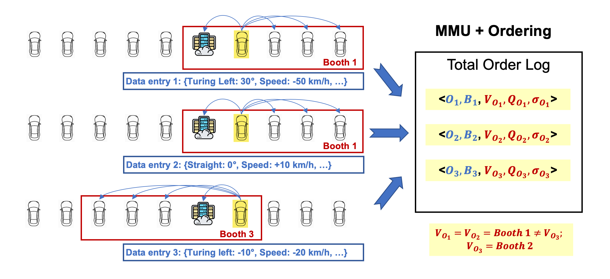
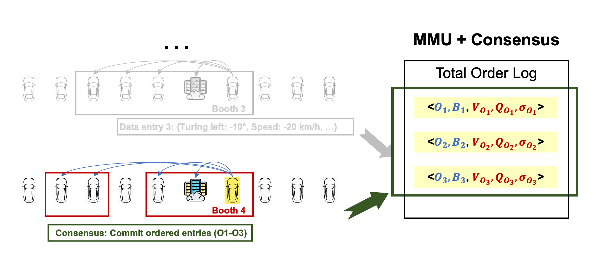

<h1 align="center"> V-Guard: An Efficient Permissioned Blockchain for Achieving Consensus under Dynamic Memberships in V2X Networks </h1>

## About V-Guard

V-Guard achieves high performance operating under dynamically changing memberships, targeting the problem of vehicles' arbitrary connectivity on the roads. When membership changes occur, traditional BFT algorithms (e.g., PBFT and HotStuff) must stop to update system configurations using additional membership management approaches, thereby suffering from severe performance degradation.

In contrast, V-Guard integrates the consensus of membership management into the consensus of data transactions. In a consensus process, The integration makes V-Guard achieve consensus seamlessly under changing members (e.g., with joining or leaving vehicles) and produces an immutable ledger recording traceable data transactions with their corresponding membership profiles.

    Consensus target of tradition BFT algorithms: <data transactions>
    Consensus target of V-Guard: <data transactions, membership profiles>

Check out the paper at: https://arxiv.org/abs/2301.06210

## Use Case
V-Guard is a flexible blockchain platform that allows users to define their own message types. This platform enables vehicles to reach a consensus on the decisions made by their autonomous driving software. The messages can include various data, such as GPS location, speed, direction, acceleration, bearing, and more (similar categories to the data set of
[Passive Vehicular Sensors](https://www.kaggle.com/datasets/jefmenegazzo/pvs-passive-vehicular-sensors-datasets?resource=download-directory)).

V-Guard offers a solution to the trust and accountability issues associated with accident data by providing a guarantee of data accuracy and integrity. Our blockchain technology effectively addresses three key challenges that are often encountered with traditional centralized solutions:

- **Transparency in data management.** Data is more easily accessible to drivers, thereby preventing manufacturers from monopolizing it.
- **Integrity in data management.** V-Guard prevents data tampering. There is no room for manipulation or concealment of evidence by either drivers or manufacturers. V-Guard ensures that data cannot be fabricated or deleted, even if it goes against the interests of the parties involved in legal proceedings
- **Accountability in data management.** V-Guard promotes data accountability and ownership protections, creating a trusted environment within the industry, and ensuring compliance with data management regulations, such as GDPR and CPRA.

## Features and Workflow

#### Membership Management Unit (MMU)
V-Guard develops a Membership Management Unit (MMU) that keeps track of available vehicle connections and manages membership profiles. The MMU describes a membership profile that contains a set of vehicles as a **booth**. Below illustrates the management of booths (of size 4) when vehicles are communicating via [Dedicated Short-Range Communication](https://en.wikipedia.org/wiki/Dedicated_short-range_communications).

### An Example of V-Guard's workflow
In the below example, the yellow car is the proposer, and the MMU manages 10 members. The consensus target are the data (in blue font) and membership (in red font), where O is the orderingID (sequence #), B is the data batch, V is the booth, Q is the quorum, and Sigma is the threshold signature.

Ordering instances can take place in different booths. E.g., when the proposer conducts consensus for data entry 1, the ordering takes place in Booth 1. When Booth 1 is still available, the next ordering instance reuses it (e.g., data entry 2). However, when Booth 1 becomes unavailable (e.g., some vehicles go offline), the MMU will provide a new booth (i.e., Booth 2) for the next ordering instance.

Consensus instances are executed periodically as "shuttle buses" with a sole purpose of committing the entries appended on the total order log. A consensus instance (C) can also operate in a different booth where the new members will scrutinize the signatures of included entries that they have not validated previously.

## Try the Current Version

### Install dependencies
GoLang should have been properly installed with `GOPATH` and `GOROOT`. The GoLang version should be at least `go1.17.6`. In addition, three external packages were used (check out `go.mod`).

    // threshold signatures
    go get go.dedis.ch/kyber
    // logging
    go get github.com/sirupsen/logrus
    // some math packages
    go get gonum.org/v1/gonum/

### Run V-Guard instances locally
Below shows an example of running a V-Guard instance with a booth of size 4 and 6 initial available connections. The quorum size of a booths of size 4 is 3, so the threshold is set to 2, as the proposer is always included.
    
    // Assume the downloaded folder is called "vguardbft"
    // First, move the keyGen folder outside of vguardbft.
    mv keyGen ../
    
    // Then, go to "keyGen" and generate keys
    cd ../keyGen
    go build generator.go
    
    // Keys are private and public keys for producing and 
    // validatoring threshold signatures where t is the threshold
    // and n is the number of participants
    ./generator -t=2 -n=6
    
    // A "keys" folder should be generated with 6 private keys and 1 public key
    // Privates keys: pri_#id.dupe
    // Public key: vguard_pub.dupe
    // Now copy the "keys" folder into the "vguardbft" folder
    cp -r keys ../vguardbft/
    
    // Compile the code in "vguardbft" using the build script
    cd ../vguardbft
    ./scripts/build.sh

    // Next, create a log folder
    mkdir logs
    
    // Finally, we can start running a V-Guard instance by starting
    // a proposer, which always has an ID of 0. The script takes 
    // two parameters: $1=ID; $2=role (proposer: 0; validator: 1)
    ./scripts/run.sh 0 0 // this starts a proposer

    // run 5 validators
    ./scripts/run.sh 1 1 // this starts a validator whose ID=1
    ./scripts/run.sh 2 1 // this starts a validator whose ID=2
    ./scripts/run.sh 3 1
    ./scripts/run.sh 4 1
    ./scripts/run.sh 5 1

Check out `parameters.go` for further parameters tuning.

## Projects using V-Guard
| Project Name                                           | Authors                     | Features                                                              |
|:-------------------------------------------------------|:----------------------------|:----------------------------------------------------------------------|
| [VGuardDB](https://github.com/timchenggu123/vguard_db) | Michalis Bachras, Tim Cheng | Efficiently Storing and Accessing Data from V2X Networks Using VGuard |